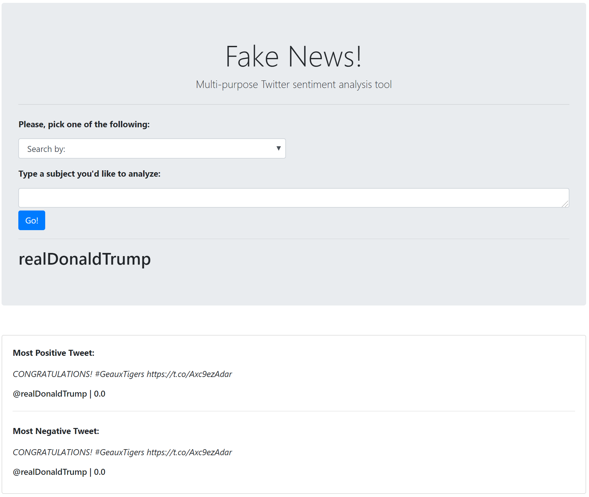

# Final-Project
## Team: 
Raymond Fendi, Gizem Yali-Pepper, Hernan Hernandez, Alla Zbirun, Vlad Schepkov

## Project Summary:
Fake news! Since D Trump winning 2016 election Twitter became a significant vessel in getting latest sentiment of the current events.  We built a twitter natural language processing (NLP) analysis app, which pulls latest 200 tweets via API call based on the user input criteria and updates the dashboard with the latest information.  

### Data Analysis:
Retrieved tweeter data is organized into a number of dictionaries and stored into a dataframe for further analysis and plotting.  We utilized the TextBlob sentiment analysis on “full_text” data to determine polarity and subjectivity scores and added the outcome to the dataframe.  The dataframe is refreshed every time the user updates the search request.  Finaly, we use dataframe to produce number of visualizing plots using Plotly and displayed them on the dashboard.

### Tools Utilized:
* Pandas, Numpy, Counter
* Twitter API, TextBlob, Sklearn
* Plotly, Matplotlib
* Html, CSS, Flask
* Heroku 

### Visualization:
User will make a selection from the search dropdown menu, type desired search value and hit “Go” button.  For example below we will select “handle” and type “realDonaldTrump” in the input field.  Once the request is executed the app will update the page. 

The scatter plot shows each retweet and its polarity value color-coded by the sentiment classification.

The gauge plot show mean sentiment value for the current search output.

The bar chart most commonly used device used by the author of the tweet.

The table show the summary of data received from the current search.

